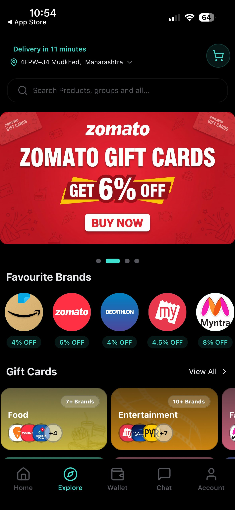
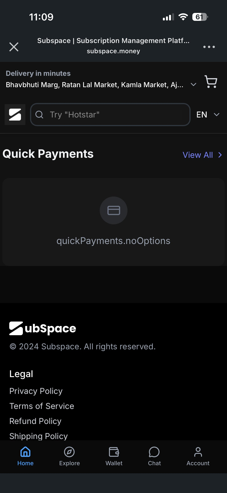
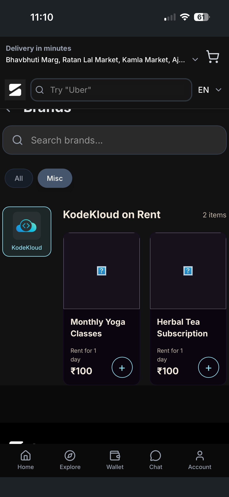
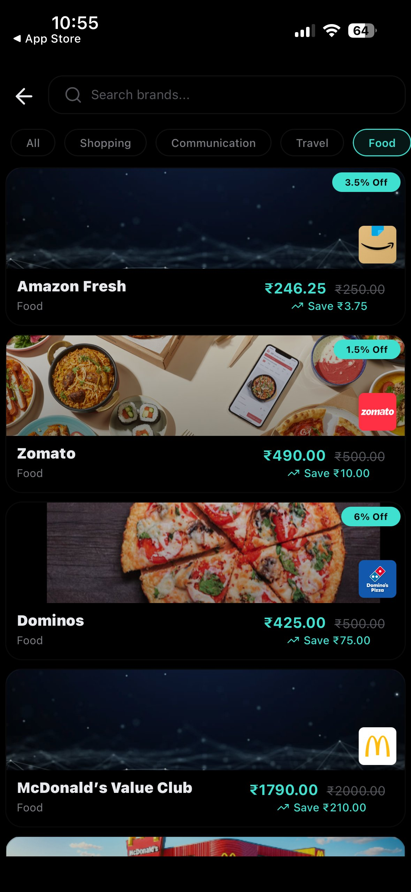
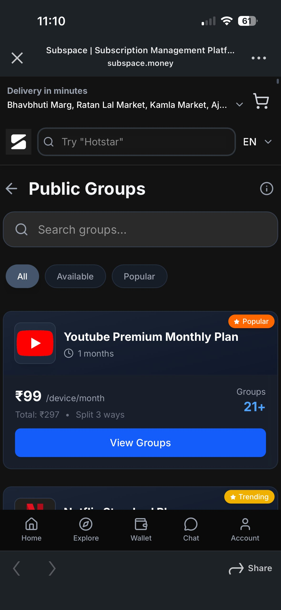
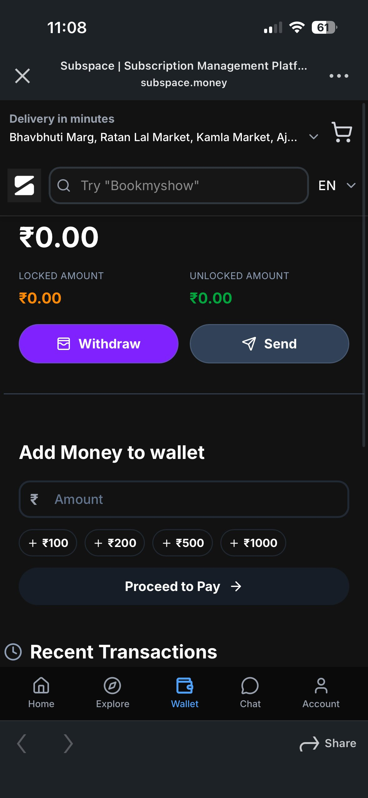

# Subspace — what I found, and what I'd fix first

*A product teardown by [Your name]. I used the app and the web app as a normal customer for a few days before writing any of this. Everything below is something I actually ran into. Screenshots sit alongside each point, and there's a small interactive model in `/models`.*

---

## The one thing I'd fix Monday

I couldn't log into the mobile app. The OTP never arrived, across several tries on my phone. So I did the whole teardown on the web app instead, where login worked fine.

That's worth sitting with for a second. The single most important moment in the entire product — a new user deciding they're in, and asking to be let in — is the one that broke for me. Everything else in this document is a distant second to that. If I owned this product, that's the first thing I'd put a person on, before any new feature.

---

## What's actually going on here

Subspace is trying to be three products at once.

It's a **marketplace** (buy gift cards and OTT subscriptions at a small discount). It's a **subscription manager** (track and split what you already pay for). And it's a **wallet / group-finance app** (load money, send, KYC, locked and unlocked balances). Three different products, three different reasons to show up.

The trouble is they're all wearing the same skin — and the skin is a quick-commerce one. The home screen says "Delivery in 11 minutes." There's a "search delivery location" box. The footer has a "Shipping Policy." There's a section called "Subspace Minutes." None of that means anything for gift cards and digital subscriptions, because there's nothing to deliver and nothing to ship.

![Delivery in 11 minutes on a gift-card screen]

Once you see it, you can't unsee it, and most of the smaller problems below are really just this same thing leaking through in different places. So I'm not treating them as five unrelated bugs. They're five symptoms of one cause: a templated build that was never re-fitted to what Subspace actually sells. That matters more for a money app than almost anywhere else, because the product is asking me to load real cash into a wallet while showing me copy that doesn't add up.

## Who I think this is for

My best read on the core user: someone in their twenties, in an Indian metro, who already pays for three or four digital subscriptions, is price-sensitive enough to want to split or pool them, and is willing to put money through a new fintech wallet to do it. That's a real, specific person.

Hold that person in your head while reading the rest, because a lot of the product's choices don't actually serve them — they serve a different, vaguer "everyone who likes saving money" idea, and end up serving no one cleanly.

## How I picked these five, and why they're in this order

I sequenced them by where they hit in the funnel, not by how annoying they are to look at. A problem that blocks every single new user beats one that mildly bugs some of them, every time. So login and trust come first, browse-experience and long-term strategy come after. Five problems, spread on purpose across the product pillars so they're not all crammed into "UX."

---

## 1. The login wall fails at the worst possible moment
**Pillar: Features / Services**

**Observed.** On the mobile app, requesting an OTP to log in didn't get me an OTP. I tried more than once. I never got in on mobile and had to move to web.

**Problem.** This is the activation step. Everything the product wants me to do — load money, track subs, join a group — sits behind this one door, and the door didn't open. A user who downloaded the app, got curious enough to want in, and then couldn't get in is the most expensive kind of user to lose, because you already paid to acquire them and they already wanted to be there. I can't tell you what share of users this hits from one phone. But I can tell you the cost of it being broken is the entire rest of the product, every time it happens.

**Ship instead.** Treat OTP delivery as a tier-one reliability problem, not a feature. Instrument the request-to-success rate and alert on it. Add an immediate fallback — WhatsApp OTP or a "call me with the code" option are both normal in India and both cheaper than a lost user. And surface a real, retryable error state instead of a dead screen, so the user knows it's the system and not them. The activation model in `/models` lets you set the OTP success rate (stage F2) and watch what reliable delivery recovers across the whole funnel.

## 2. Everything feels half-built right when I'm about to pay
**Pillar: UX (and trust, which runs underneath all of it)**

**Observed.** The Quick Payments box renders the raw text `quickPayments.noOptions` — a code string that was never replaced with real copy.

A category called "KodeKloud on Rent" is sitting in the live app next to "Monthly Yoga Classes" and "Herbal Tea Subscription," both with broken image placeholders and both "Rent for 1 day."

And it keeps going. A gift card is labelled "₹1000 / month." My profile defaults to the name "User" with username "Not set." The footer says "© 2024." This is mid-2026. (See `screenshots/giftcard-1000-month.png`, `profile-not-set.png`, `copyright-2024.png`.)

**Problem.** Any one of these is nothing. Together they tell a story, and the story is "no one is really minding this place." That's a bad story for any app and a much worse one for a wallet. Right after seeing all this, the app asks me to add money and do KYC. The exact moment it needs me to trust it most is the moment it's showing me leftover test data and untranslated code. Trust doesn't fail on the payment screen; it's already gone by the time I get there.

**Ship instead.** Two passes. First, a cleanup sweep before the next release — kill the test data, replace the raw string keys, fix the dates, set a sensible default profile state. Cheap, fast, high return. Second, and more important, a rule: nothing test-flavoured ships to production. The fact that "Herbal Tea Subscription" is live at all means there's no gate between staging and what users see. Closing that gate is the actual fix; the cleanup is just the symptom.

## 3. The app shows its weakest hand before login, and hides its best one
**Pillar: GTM & ICPs**

**Observed.** You don't have to log in to look around. You land straight in Explore and can browse deals, brands, and subscriptions freely. Login only gets asked for when you tap Wallet or Home. I actually liked this a lot at first — let people see the goods, then ask them to sign up once they're interested.

**Problem.** Here's where I changed my mind, and I think this is the more useful read. Letting people browse before signing up is the right call. But *what* they get to browse for free is the most generic part of the whole product — gift cards at one to six percent off, which Amazon, CRED, Park+ and a dozen others also do. The genuinely different stuff, the reasons this product exists — tracking your own subscriptions, splitting them with a group, the wallet — all of that needs your data, so it's locked behind the login wall. So the free preview is the part of Subspace with the least pull, and the sticky part stays invisible until after the thing I'm trying to get past. The pattern is right. The payload is backwards.

**Ship instead.** Keep the no-login browse. But make the pre-login experience lead with the differentiated hook, not the commodity one. Show a live "you could split Netflix three ways and pay ₹99 instead of ₹297" demo with dummy data, right there in Explore, before any login. Let people feel the group-splitting value with their hands before you ask who they are. Right now the order of operations is selling the one thing that doesn't need Subspace at all.

## 4. The core saving trick leans on something the platforms are actively killing
**Pillar: Competitor Analysis**

**Observed.** Under Public Groups, you can join a group of strangers to share a subscription — "Netflix Standard Plan, ₹250/device," "split 3 ways," "21+ groups" for YouTube Premium. The pricing is per-device, and the whole model is built on pooling one account across several unrelated people.

**Problem.** That's account sharing, and the platforms it depends on have spent the last couple of years shutting it down. Netflix went after password sharing hard and it worked for them. The cheapest, most eye-catching part of Subspace's pitch sits on top of other companies' terms of service, and those companies have both the motive and the proven ability to break it. If the shared-account model gets squeezed, the headline discounts go with it. This isn't a UI problem you can design around; it's a question about whether the core value prop is standing on solid ground.

**Ship instead.** I'd want the company to be honest internally about which parts of the catalogue are durable and which are borrowed. Lean into the things platforms actually bless — official family plans, legitimate group billing, partnerships — and treat grey-area pooling as a hook that brings people in, not the foundation you build the business on. The subscription-management and wallet sides don't depend on anyone's ToS. That's where the defensible product is. I'd shift weight there before the borrowed part gets taken away.

## 5. Subspace is building rails it could rent
**Pillar: Potential Collaborations**

**Observed.** The app runs its own wallet — add money, withdraw, send, locked and unlocked balances — and pushes its own KYC ("Know Your Customer") flow. On the supply side, there's a "Sell Products — manage and list your vendor products" surface, and the gift-card catalogue is stitched together brand by brand (Amazon, Zomato, Decathlon, Myntra and so on).

**Problem.** Both of those are heavy things to own. A stored-value wallet with KYC drags you into prepaid-instrument and RBI territory, which is a lot of compliance weight for a team this size to carry alone. And aggregating brands one at a time is slow. These are exactly the kinds of capability that are usually better rented than built, especially early.

**Ship instead.** On the money side, partner with an existing payments or UPI provider for the wallet and KYC rails instead of carrying that infrastructure and its compliance load in-house. On the supply side, plug into a gift-card or rewards aggregator to get breadth fast rather than signing brands individually. The point isn't to outsource the product — it's to stop spending scarce engineering on undifferentiated plumbing and spend it on the subscription-tracking and group-splitting features that are the actual reason to use Subspace. *(This is the one feedback I reasoned about from the product surface rather than something that blocked me in a flow, so I've held it last and kept the claims to what's visible in the app.)*

---

## What I'd want to check before trusting any of this too far

I'm working from the outside, so a few of these rest on inference, and I'd rather say so than pretend otherwise.

I don't know why the app is built on a quick-commerce template — maybe it's a deliberate base they're re-skinning in stages, maybe there's history I can't see. If there's a reason, I'd want to hear it before touching it. I don't have the funnel data, so the numbers in the model are illustrative defaults, not measured rates; the one exception is the OTP step, where the *existence* of the problem is anchored to my own failed logins, even though one phone can't tell me the population rate. And the account-sharing risk is a judgement call about where the platforms go next, not a certainty. None of that changes the five problems. It just marks the line between what I saw and what I'm guessing.

## What's in this repo

- `/screenshots` — the things above, captured in the app, named by what they show.
- `/models/activation-funnel-model.html` — a small interactive model of the activation funnel. Open it in a browser. It only moves the three numbers my fixes actually touch (activation, OTP, trust) and holds everything else constant, so the result can't borrow credit from anything else. Replace my defaults with your real data and the size of the prize re-derives itself.

If you only open one thing, open the model and read feedback #1. That's the one I'd fix first, and it's the one I'd want to be judged on.
